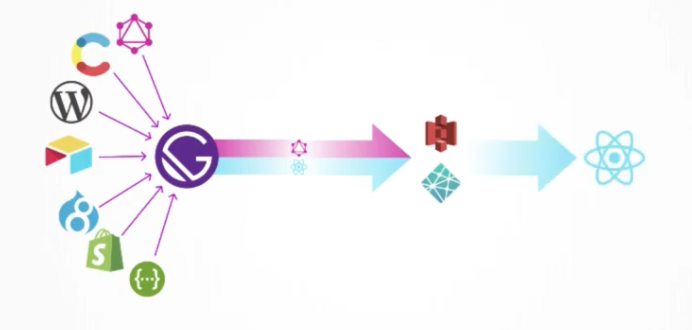

  

# 👋 Hello nosey developer

  My name is Kenneth Cruz, I'm a plant dad 🍀 , dog dad 🐶, and aquarium enthusist 🐠. And yes I love using emojis, it adds color and tone to these boring md files 🤷‍♂️
   
    
  I'm from native New Yorker, I'm a graphic designer and software engineer. This is the source code for my personal portfolio, it provides a collection of my work, sculpture, print work, branding, UX/UI work and developer work.

## 😈 Gatsby

I love JavaScript! React is my main go-to tool. So I decided to work with Gatsby to showcase my work's collection.
 
 

Gatsby is a React framework that serves up static files for the client. 
  

Benefits:

1. Loads data from site's source using GraphQL to generate static assets
2. Performance tuning
   1. example: you have a 1000px * 1000px image Gatsby will worry about serving up the best version of that image for small screens, to desktop size and resolution
3. Static assents lets you deploy to any CDN
4. This static site will Re-hydrate into a React app in any Browser! 😈

## Folder Structure and Component Architecture

🏛️ In this section I'll be walking through the design architecture 

### data 📁

🍬

1. This folder holds a *data.json*
   1. This holds all my works in an array of objects to later use in my `works/index.js` component

2. icons
   1. This folder holds my logo in a svg file for the site's favicon.
   2. It also holds the favicon log in black. 

3. Images
   1. This folder has been ignored in the .gitignore. All images are at print quality (300ppi) and should not exist on github. 
      1. landing
      2. logo
      3. self
      4. posters

## src 📁

### components 📁

> Collection of Reusable components + SCSS files

layout.js 

  1. this has a staticQuery to get the SiteMetaData for the title of the browser tab + allFile query for the logo to be passed to header.js
  2. Passes data => Header
  3. loads {children} in main
  4. NOTE: loads layout.scss for to set consistent font, colors, and font size

header.js 

  1. This header loads logo
  2. Calls for Nav.js 

nav.js 

  1. Uses react-bootstrap Navbar
  2. uses Nav.Link for react/Gatsby loading routing

posters.js 

  1. uses Image from react-bootstrap, takes in prop of the poster images
  2. this component is called from the posters page

seo.js 

  1. This file is for Search Engine Optimization
  2. this came built in from the Gatsby source code

works.js 

### fonts 📁

Fonts used 

1. This is a folder for my preferred font for this site. *OperatorMono* for paragraphs. 
2. NOTE: loading Roboto from google fonts in the layout.scss

### pages 📁

index.js 

   1. This is the landing page
   2. staticQuery for json obj for the landing carrousel
      1. json object provides links to those featured projects through the work's title and image. 

404.js 

1. This is built in from Gatsby source code. 
2. 404.js is for when a user wanders off into a stange route and the site cannot serve this static site

about.js 

   1. StaticQuery from Images to find `self`
   2. Gives an About me.

contact.js 

   1. 

### gatsby-browser 📄

🍬

   1. Helps load bootstrap onto the react-app

### gatsby-config 📄

This is where the 💰 is. Plugins is Gatsby uses to load, transpile, improve performance and also sets the favicon for  the site.

> NOTE: When plugins DONT require options the plugin can just be passed in the array
>
> NOTE: when the plugin NEEDS or you WANT to pass it viable options you pass it as an object

🍬

   1. `gatsby-plugin-sass` transpiles into css for the browser
   2. `gatsby-plugin-react-helmet`
   3. `gatsby-transformer-json`, this helps GraphiQL to parse JSON into GraphQL refer to `gatsby-source-filesystem`
   4. `gatsby-transformer-sharp` this allows us to query one high res image and create SVGs, JPEGs, PNGs, in many sizes for the screen resolution your screen will need
   5. `gatsby-plugin-sharp` this works in partnership with it's transformer.
   6. `gatsby-source-filesystem` this plugin is called twice. once for the json file and the second time for the images folder. this tells Gatsby where to plug in it's GraphQL db.
   7. `gatsby-plugin-manifest` this plug in comes with gatsby built in, this sets a preset theme, start URL, and favicon.

### gatsby-node 📄

### package-json 📄